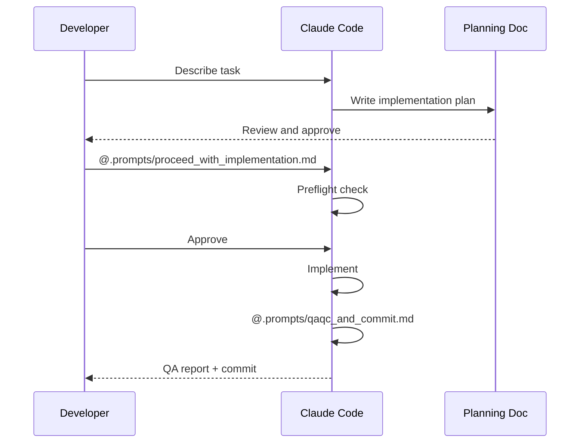

# Usage

## Getting started

Import the package and call the sample function:

```python
import multidriver_swg

result = multidriver_swg.hello("world")
print(result)  # Hello, world!
```

## Development workflow

This project follows a plan-then-implement workflow:


